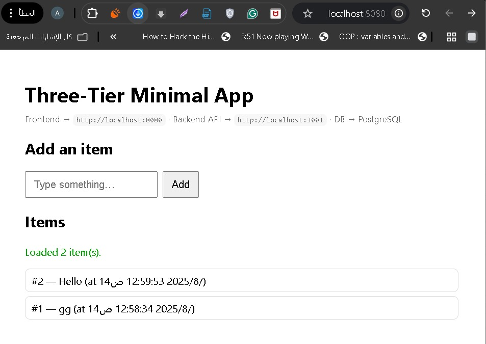

# Three-Tier App

> A full-stack three-tier application combining a frontend, backend, and PostgreSQL database, orchestrated with Docker Compose.

---

##  Table of Contents

- [Overview](#overview)  
- [Architecture](#architecture)  
- [Prerequisites](#prerequisites)  
- [Installation & Setup](#installation--setup)  
- [Usage](#usage)  
- [Environment Variables](#environment-variables)  
- [Project Structure](#project-structure)  
- [Testing](#testing) *(if applicable)*  
- [Contact](#contact)  

---

## Overview

This application demonstrates a classic three-tier architecture:

1. **Frontend** – user interface (e.g., React, Vue, or plain HTML/JS)  
2. **Backend** – RESTful API (e.g., Node.js/Express)  
3. **Database** – PostgreSQL for persistent storage  

All services are containerized and configured via Docker Compose for easy deployment and development.

---

## Architecture

```plaintext
┌──────────┐        ┌──────────┐        ┌──────────────────┐
│          │        │          │        │                  │
│ Frontend ├───HTTP──► Backend ├───SQL──► PostgreSQL DB     │
│          │        │          │        │                  │
└──────────┘        └──────────┘        └──────────────────┘
```

---

## Prerequisites

Before running the project, ensure you have the following installed on your system:

1. **Docker** – (version X.X or later)
2. **Docker Compose** – (version X.X or later)

You can verify your setup with:

```plaintext
docker --version
docker compose version
```

---

## Installation & Setup

1. **Clone the repository**:
```plaintext
git clone https://github.com/AhmedDev374/three-tier-app.git
cd three-tier-app
```

2. **Copy the environment template (if applicable):**:
```plaintext
cp .env.example .env
```
Then open .env and set your environment variables (DB credentials, ports, etc.).

3. **Start all services using Docker Compose:**:
```plaintext
docker compose up --build
```

3. **Access the application:**:
- Frontend: http://localhost:3000 (modify based on your setup)
- Backend API: http://localhost:3001/api (adjust accordingly)

---

## Usage

- **Frontend:** Navigate to the UI and follow the on-screen instructions (e.g., create, read, update, delete functionality).
- **Backend API:** Use tools like curl or Postman:
```plaintext
curl http://localhost:3001/api/resource
```
---

## Environment Variables

Below are common  ```.env```  variables (modify as necessary):
```plaintext
DB_HOST=postgres
DB_PORT=5432
DB_USER=your_db_user
DB_PASSWORD=your_db_password
DB_NAME=your_db_name

BACKEND_PORT=3001
FRONTEND_PORT=3000
```
---

## Project Structure
```plaintext
three-tier-app/
├── frontend/          # UI code (HTML/CSS/JS or React/Vue)
├── backend/           # API server code (Express, etc.)
├── docker-compose.yml
├── .env
└── README.md
```
---

## Usage

- **Frontend:** Navigate to the UI and follow the on-screen instructions (e.g., create, read, update, delete functionality).
- **Backend API:** Use tools like curl or Postman:
```plaintext
# For backend:
cd backend
npm test

# For frontend:
cd frontend
npm test
```

---

## Contact

For questions or feedback, reach out to Ahmed at

1. **LinkDin**: https://eg.linkedin.com/in/ahmed-atef-elnadi-8165a51b9

---

## License

This project is licensed under the **GNU General Public License v3.0**.  
See the full license text here: [LICENSE](LICENSE).
